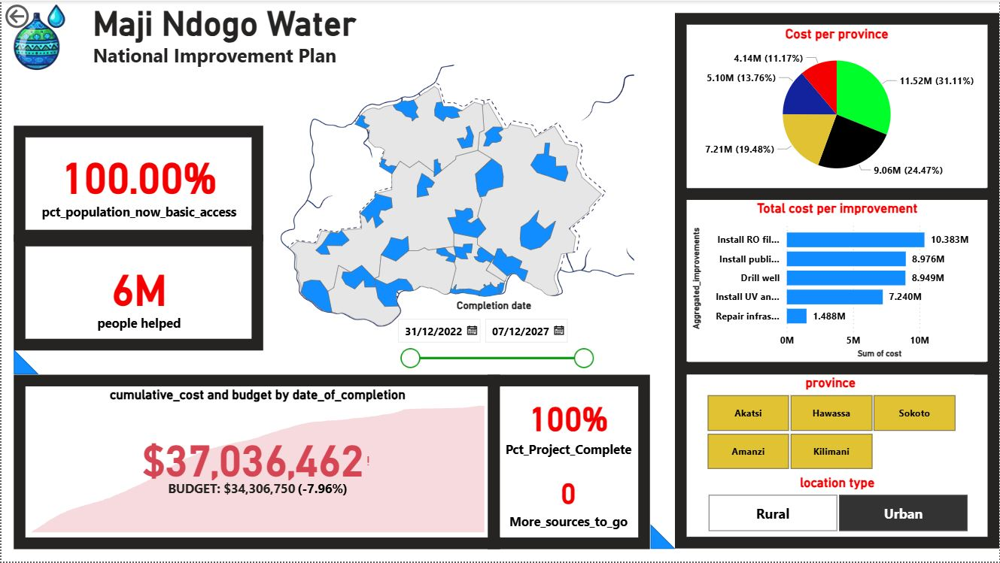
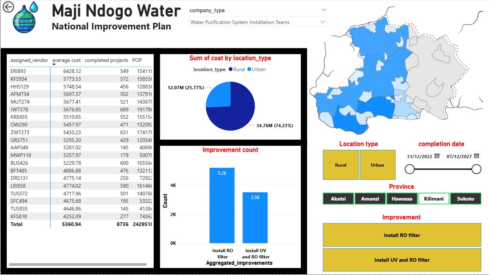

# 💧 Maji Ndogo Water Crisis Analysis  
**From Detecting Corruption to Designing Solutions with SQL & Power BI**

---

## 📌 Project Overview  
The **Maji Ndogo Water Project** is a fictional but data-driven case study that demonstrates how **data analysis, SQL, and business intelligence** can address critical infrastructure issues.  

The project follows a complete data journey:  
1. **Detecting corruption** by comparing surveyor and audit datasets (SQL + Jupyter).  
2. **Designing interventions** with SQL queries and database modeling.  
3. **Visualizing the improvement plan** using **Power BI dashboards**.  

This repo highlights how **data storytelling** can turn raw data into **actionable recommendations** for communities.  

---

## 🔑 Key Insights  
- **193 discrepancies** found between surveyor reports and audit results.  
- **4 employees** identified as responsible for most inaccurate survey entries.  
- **43%** of citizens rely on **shared taps**, often overcrowded (2,000 per tap).  
- **31%** of homes have taps, but **45% are broken**.  
- **18%** rely on wells, but only **28% are safe**.  
- Rural provinces (e.g., **Sokoto, Amanzi**) are underserved, while urban areas have better access.  
- The **National Improvement Plan** projects:  
  - Helping **6M people** achieve basic water access.  
  - **100% completion** by 2027.  
  - Total cost: **$37M**, exceeding budget by **~8%**.  
  - Largest costs from **RO filters (10.3M)** and **public tap installations (8.9M)**.  

---

## 🛠️ Technologies Used  
- **SQL (MySQL)** → Queries, joins, integrity checks, database design.  
- **Jupyter Notebook** → Documenting SQL workflows & findings.  
- **Power BI** → Dashboards showing costs, vendors, improvements, and provincial disparities.  
- **ETL concepts** → Preparing and joining data for BI reporting.  

---

## 📊 Dashboards  
### 1. National Improvement Plan  
- % population now with basic access (100%)  
- 6M people helped  
- Total cost breakdown by **province** and by **type of improvement**  
- Progress tracking over time  

### 2. Vendor & Location Analysis  
- Vendor performance (average cost, projects completed, population covered)  
- Cost split: **Rural vs Urban** (74% Urban vs 26% Rural)  
- Improvement count (RO filters, UV + RO filters)  
- Regional disparities highlighted on map  

---

## 📂 Repository Structure  
